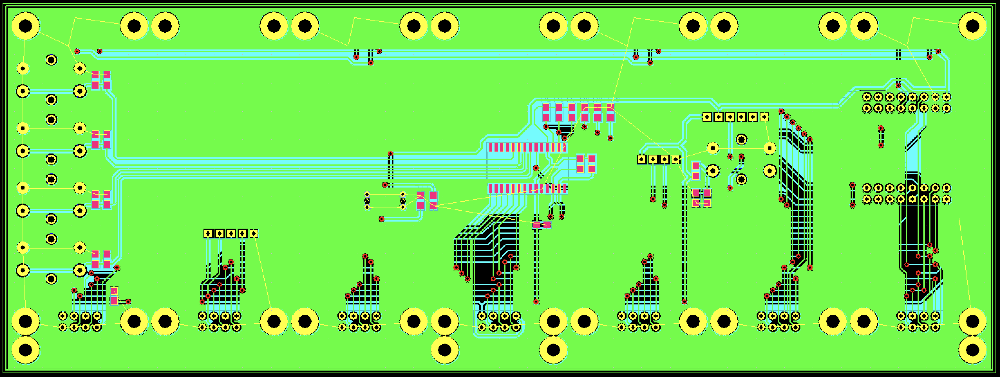

# Board revisions

| PCB Version | Version blockhash | Changelog | Activ |
|---|---|---|---|
| V.0-10 | [00000000000000000001a5363330f9cc3d55f383f37b87791bd1b772c6dbded4](https://mempool.space/block/00000000000000000001a5363330f9cc3d55f383f37b87791bd1b772c6dbded4) | First Beta | D.S. |
| V.1-00 | [00000000000000000004b660247df8ef1f91231d5b3877fcfaca8a03c709cb72](https://mempool.space/block/00000000000000000004b660247df8ef1f91231d5b3877fcfaca8a03c709cb72) | First Version | D.S. |
| V.1-22 | [0000000000000000000540c807c73e5a4ba24284ee351d287978e324a786dae3](https://mempool.space/block/0000000000000000000540c807c73e5a4ba24284ee351d287978e324a786dae3) | Added USB-C on the back. (Power only) | D.S. |
| V.1-23 | [00000000000000000001ac31d136df6577f457e683e8b98b03d628840a1d3b4c](https://mempool.space/block/00000000000000000001ac31d136df6577f457e683e8b98b03d628840a1d3b4c) | Follow UP USB-C on the back. Added diode for reverse polarity protection | D.S. |
| V.1-40 | [00000000000000000001b035d353d599df6fa46122c07cf2036ae9959669a4b2](https://mempool.space/block/00000000000000000001b035d353d599df6fa46122c07cf2036ae9959669a4b2)  | Follow UP Greater holes for diode and placement marking R1 | D.S. |
| V.1-41 | [0000000000000000000126c60537b7b83e2cbc38eed1b652e24d870bd5591139](https://mempool.space/block/0000000000000000000126c60537b7b83e2cbc38eed1b652e24d870bd5591139) | SMD Capacitors to Back | |
| V.1-45 | [000000000000000000031ae555d445f1f0349d68afba1da7c3bd9b908868dd6c](https://mempool.space/block/000000000000000000031ae555d445f1f0349d68afba1da7c3bd9b908868dd6c) | Follow Up Full SMD Version | |

D.S. Discontinued but still supported by the software.

[Trough hole version V.1-41](https://git.btclock.dev/btclock/hardware/src/branch/main/Main-PCB/BTClock-V812186_RevA_Main-PCB)

[SMD version V.1-45](https://git.btclock.dev/btclock/hardware/src/branch/main/Main-PCB/BTClock-V833964_RevA_Main-PCB)